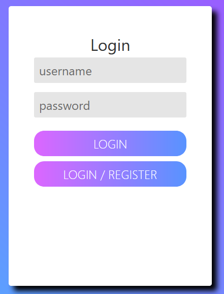
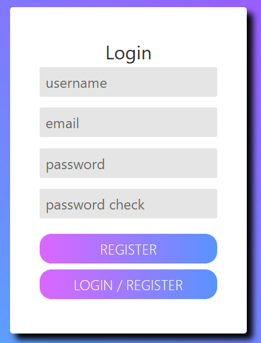
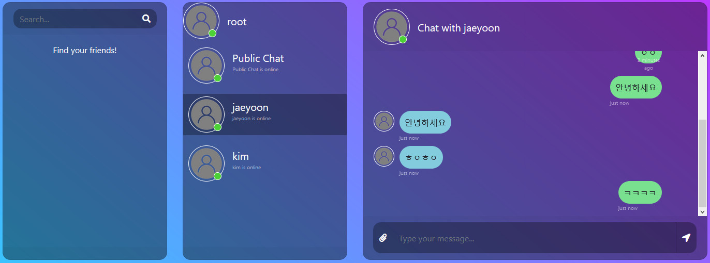

## DjangoChat

Chat application using Django, React

#### ToUse

```
~# cd frontend
~/frontend# yarn
~/frontend# yarn build
~/frontend# mv build ../app/

~# docker-compose build
~# docker-compose run app sh -c "python manage.py collectstatic"
~# docker-compose up
```

<div align="center">

<h2>Login Page</h2>



<h2> Chat</h2>

</div>
